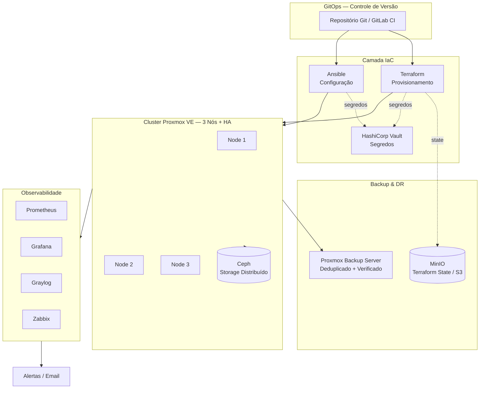
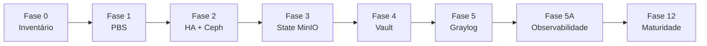

# SRE Infrastructure — Confiabilidade e IaC em Ambiente On-Premises Crítico

> Implementação de práticas de **Site Reliability Engineering (SRE)** e **Infraestrutura como Código (IaC)** em um datacenter on-premises, *air-gapped* (intranet-first) e de missão crítica.


---

## 📌 TL;DR

Projeto de engenharia de confiabilidade que transforma uma operação de TI **manual e frágil** em uma plataforma **automatizada, observável e recuperável**, aplicando princípios de SRE em um ambiente sem acesso à internet.

| Indicador | Antes | Depois (meta) | Impacto |
|---|---|---|---|
| **MTTR** (recuperação de serviço) | ~24 horas | **~5 minutos** | **↓ ~99%** |
| Recuperação de desastre | Apenas dados (restore manual de SO) | Serviço + provisionamento automatizado | Continuidade de negócio |
| Gestão de infraestrutura | Manual, não rastreável | Versionada em Git (IaC) | Auditabilidade total |
| Observabilidade | Pontual (métricas isoladas) | Logs + métricas + dashboards unificados | Detecção em < 2 min |
| Gestão de segredos | Credenciais dispersas | Centralizadas no Vault | Redução de superfície de risco |

> ⚠️ **Nota sobre os dados:** este repositório é um estudo de caso de portfólio. Todos os IPs, hostnames, nomes de organização e segredos foram **sanitizados** e substituídos por valores de exemplo. Nenhuma informação confidencial do ambiente real está presente.

---

## 🎯 O Problema

A arquitetura original apresentava um risco crítico de continuidade: os **backups eram realizados apenas internamente nos sistemas operacionais**. Isso garante a recuperação dos *dados*, mas não do *serviço*. Não havia nenhum mecanismo para agilizar reprovisionamento e reconfiguração, fazendo com que o **Mean Time To Recovery (MTTR) ficasse em torno de 24 horas**.

Em um ambiente de missão crítica, 24 horas de indisponibilidade de serviços essenciais (Active Directory, DNS, DHCP, file server, sistemas de documentos) é inaceitável.

## 💡 A Solução

Aplicar **SRE de ponta a ponta** sobre a infraestrutura, tratando a infraestrutura como código e construindo capacidade real de recuperação automática:

- **Proxmox Backup Server (PBS)** — backups deduplicados, verificados e testados, com restore garantido.
- **Cluster Proxmox VE de 3 nós + Ceph** — alta disponibilidade (HA) e failover automático de VMs.
- **Terraform** — provisionamento declarativo das VMs com state versionado e travado.
- **Ansible** — configuração idempotente de SOs e serviços.
- **HashiCorp Vault** — gestão centralizada de segredos.
- **Graylog + Prometheus + Grafana + Zabbix** — observabilidade unificada (logs + métricas + alertas).
- **GitOps** — toda mudança passa por Git e pipeline de CI.

O resultado é um **MTTR alvo de ~5 minutos**: diante de uma falha, a VM migra automaticamente (HA) ou é reprovisionada a partir do código + restaurada do PBS, sem reconstrução manual.

---

## 🧭 Princípios Norteadores

Estes princípios guiam toda decisão arquitetural do projeto:

- **Intranet-first** — tudo deve funcionar sem acesso à internet (ambiente *air-gapped*).
- **Incremental** — implementação em fases, sem *big bang*.
- **Pragmático** — evitar complexidade desnecessária.
- **Auditável** — logs e *state* devem ser rastreáveis.
- **Recuperável** — pensar em Disaster Recovery (DR) desde o início.

---

## 🏗️ Visão de Arquitetura



Detalhes completos em [`docs/02-arquitetura.md`](docs/02-arquitetura.md).

---

## 🛠️ Stack Tecnológica

| Categoria | Tecnologias |
|---|---|
| Virtualização / HA | Proxmox VE, Ceph, Proxmox Backup Server |
| IaC | Terraform, Ansible, cloud-init |
| Segredos | HashiCorp Vault |
| Observabilidade | Prometheus, Grafana, Graylog, Zabbix, exporters |
| CI/CD & GitOps | GitLab CI, Git, GitHub Actions (validação) |
| Storage / State | MinIO (S3 compatível), PostgreSQL (locking) |
| Serviços | Active Directory, DNS, DHCP, Samba, Nextcloud, OnlyOffice |

---

## 📂 Estrutura do Repositório

```
sre-infrastructure/
├── docs/                  # Documentação técnica
│   ├── 01-visao-geral.md
│   ├── 02-arquitetura.md
│   ├── 03-roadmap.md
│   ├── 04-slo-sli.md
│   ├── 05-observabilidade.md
│   ├── 06-disaster-recovery.md
│   ├── 07-naming-conventions.md
│   ├── runbooks/          # Procedimentos operacionais
│   └── postmortems/       # Análises de incidentes
├── terraform/             # Provisionamento (módulos + ambientes)
├── ansible/               # Configuração (roles + playbooks)
├── observability/         # Configs Prometheus / Grafana / Graylog
└── .github/workflows/     # CI de validação
```

---

## 🗺️ Roadmap (resumo)

O projeto está organizado em **12 fases** ao longo de ~42 semanas, com *checkpoints* Go/No-Go entre as fases críticas:



**Regra de ouro:** se um *checkpoint* falhar, **pare e resolva antes de avançar**. Detalhes em [`docs/03-roadmap.md`](docs/03-roadmap.md).

---

## 📖 Por onde começar

1. [`docs/01-visao-geral.md`](docs/01-visao-geral.md) — contexto e visão executiva.
2. [`docs/02-arquitetura.md`](docs/02-arquitetura.md) — arquitetura atual vs. alvo.
3. [`docs/04-slo-sli.md`](docs/04-slo-sli.md) — como a confiabilidade é medida.
4. [`docs/runbooks/`](docs/runbooks/) — procedimentos operacionais.
5. [`terraform/`](terraform/) e [`ansible/`](ansible/) — exemplos de IaC.

---

## 👤 Autor

**Eliézer Pires** — Site Reliability Engineer / Infraestrutura

Estudo de caso de implementação de SRE em ambiente on-premises crítico e air-gapped.

## 📄 Licença

Distribuído sob a licença MIT. Veja [`LICENSE`](LICENSE).
