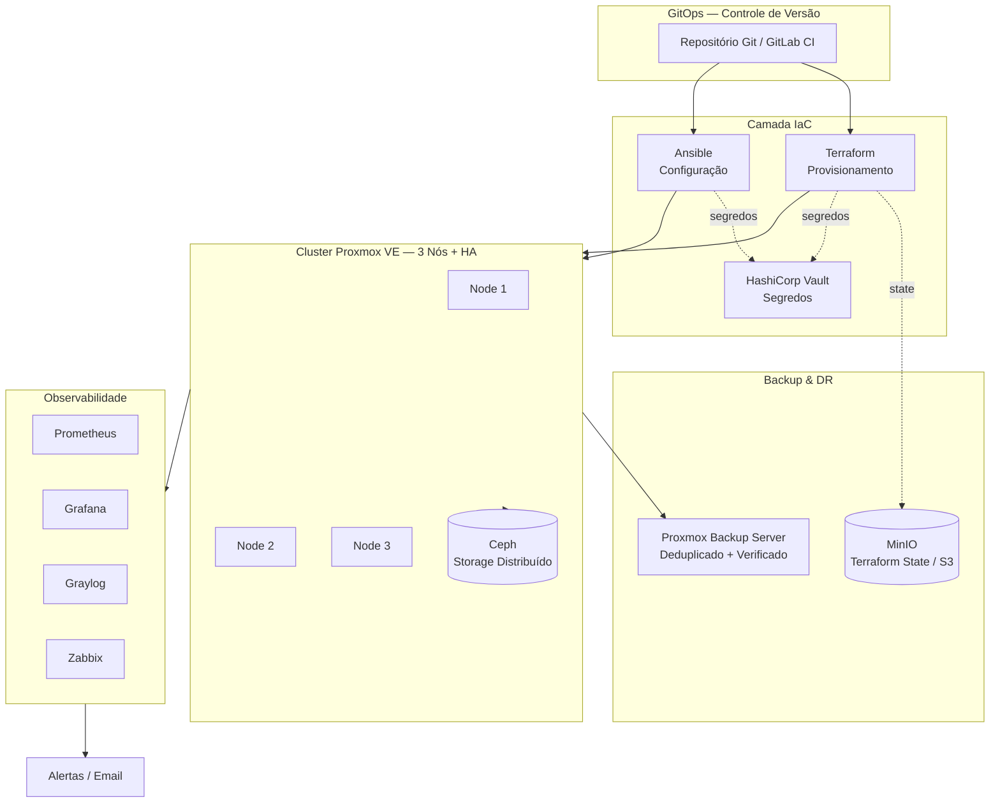
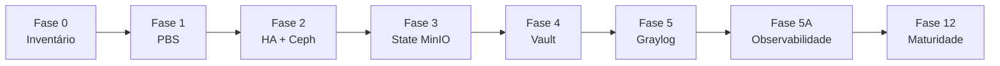

# SRE Infrastructure — Confiabilidade, IaC e Governança em Infraestrutura de Missão Crítica

> Implementação de práticas de **Site Reliability Engineering (SRE)** e **Infraestrutura como Código (IaC)** voltadas à alta disponibilidade, segurança de dados e conformidade regulatória em ambiente de datacenter moderno (on-premises, *air-gapped* ou híbrido).


---

## 📌 Visão Executiva (TL;DR)

Este projeto demonstra a transição de um modelo de TI **manual e reativo** para uma engenharia de plataforma **automatizada, auditável e resiliente**. A arquitetura foi desenhada sob os pilares da **economicidade** (redução de custos com licenciamento proprietário utilizando tecnologias open-source robustas) e **segurança da informação (LGPD)**.

| Indicador | Situação Anterior (Reativa) | Cenário Alvo (Proativo) | Impacto / Benefício Público |
|---|---|---|---|
| **MTTR (Recuperação de Serviços)** | ~24 horas (espera por intervenção manual) | **~5 minutos** (failover automático + reprovisionamento veloz) | **Continuidade garantida** dos serviços operacionais e administrativos |
| **Rastreabilidade e Auditoria** | Histórico descentralizado de modificações | Versionamento completo via Git (GitOps) | Conformidade com diretrizes de controle interno e órgãos externos |
| **Disaster Recovery (DR)** | Dependente de backups manuais e isolados | Proxmox Backup Server (PBS) automatizado | Mitigação total de risco de perda de dados e indisponibilidade prolongada |
| **Segurança e Segredos** | Credenciais em arquivos planos ou scripts | Centralização e rotação via HashiCorp Vault | Redução severa da superfície de ataque interna e externa |
| **Eficiência Financeira** | Dependência de licenciamento proprietário | Virtualização hiperconvergente de alta performance | Alinhamento com o princípio constitucional da economicidade |

> ⚠️ **Nota sobre os dados:** este repositório é um estudo de caso de portfólio. Todos os IPs, hostnames, nomes de organização e segredos foram **sanitizados** e substituídos por valores de exemplo. Nenhuma informação confidencial do ambiente real está presente.

---

## 🎯 O Desafio Técnico e Institucional

A arquitetura de infraestrutura original apresentava riscos de continuidade que impactavam diretamente a produtividade institucional: os **backups eram realizados apenas internamente nos sistemas operacionais**, sem automação a nível de hypervisor e sem replicação geográfica robusta. Isso criava um cenário em que, diante de um desastre de hardware, o **Mean Time To Recovery (MTTR) médio se estendia por 24 horas** devido à necessidade de reinstalação e configuração manual de sistemas operacionais e dependências.

Em um cenário de missão crítica (serviços internos de rede, arquivos, operacionais de controle, sistemas de gestão), a indisponibilidade prolongada afeta a transparência pública e a produtividade administrativa.

## 💡 A Solução Proposta

Aplicação de **práticas modernas de SRE e Infraestrutura como Código (IaC)** para criar uma plataforma robusta e autorrecuperável, estruturada em:

*   **Alta Disponibilidade (HA) com Proxmox VE & Ceph:** Clusterização hiperconvergente de 3 nós com storage distribuído, garantindo tolerância a falhas físicas de servidores com migração automática de VMs em segundos.
*   **Backup Integrado e Deduplicado (Proxmox Backup Server - PBS):** Garantia de integridade de dados e rapidez nos pontos de restauração.
*   **Provisionamento Declarativo (Terraform) & Configuração Idempotente (Ansible):** Eliminação do "desvio de configuração" (*configuration drift*). O estado ideal da infraestrutura é definido em código, facilitando auditorias e garantindo replicação idêntica em qualquer ambiente.
*   **Segurança Zero-Trust (HashiCorp Vault):** Isolamento absoluto de chaves e segredos criptográficos.
*   **Observabilidade Unificada (Graylog + Prometheus + Grafana + Zabbix):** Centralização de logs e métricas para identificação pró-ativa de anomalias, emitindo alertas antes que o usuário final perceba a lentidão ou interrupção.

O resultado consolidado é a redução drástica do MTTR para **~5 minutos**, permitindo uma TI que suporta com excelência o ritmo administrativo, técnico-operacional e a modernização institucional.

---

## 🧭 Princípios Norteadores

Estes princípios guiam toda decisão arquitetural do projeto:

- **Intranet-first** — tudo deve funcionar sem acesso à internet (ambiente *air-gapped*).
- **Incremental** — implementação em fases, sem *big bang*.
- **Pragmático** — evitar complexidade desnecessária.
- **Auditável** — logs e *state* devem ser rastreáveis.
- **Recuperável** — pensar em Disaster Recovery (DR) desde o início.

---

## 🏗️ Visão de Arquitetura



Detalhes completos em [`docs/02-arquitetura.md`](docs/02-arquitetura.md).

---

## 🛠️ Stack Tecnológica

| Categoria | Tecnologias |
|---|---|
| Virtualização / HA | Proxmox VE, Ceph, Proxmox Backup Server |
| IaC | Terraform, Ansible, cloud-init |
| Segredos | HashiCorp Vault |
| Observabilidade | Prometheus, Grafana, Graylog, Zabbix, exporters |
| CI/CD & GitOps | GitLab CI, Git, GitHub Actions (validação) |
| Storage / State | MinIO (S3 compatível), PostgreSQL (locking) |
| Serviços | Active Directory, DNS, DHCP, Samba, Nextcloud, OnlyOffice |

---

## 📂 Estrutura do Repositório

```
sre-infrastructure/
├── docs/                  # Documentação técnica
│   ├── 01-visao-geral.md
│   ├── 02-arquitetura.md
│   ├── 03-roadmap.md
│   ├── 04-slo-sli.md
│   ├── 05-observabilidade.md
│   ├── 06-disaster-recovery.md
│   ├── 07-naming-conventions.md
│   ├── runbooks/          # Procedimentos operacionais
│   └── postmortems/       # Análises de incidentes
├── terraform/             # Provisionamento (módulos + ambientes)
├── ansible/               # Configuração (roles + playbooks)
├── observability/         # Configs Prometheus / Grafana / Graylog
└── .github/workflows/     # CI de validação
```

---

## 🗺️ Roadmap (resumo)

O projeto está organizado em **12 fases** ao longo de ~42 semanas, com *checkpoints* Go/No-Go entre as fases críticas:



**Regra de ouro:** se um *checkpoint* falhar, **pare e resolva antes de avançar**. Detalhes em [`docs/03-roadmap.md`](docs/03-roadmap.md).

---

## 📖 Por onde começar

1. [`docs/01-visao-geral.md`](docs/01-visao-geral.md) — contexto e visão executiva.
2. [`docs/02-arquitetura.md`](docs/02-arquitetura.md) — arquitetura atual vs. alvo.
3. [`docs/04-slo-sli.md`](docs/04-slo-sli.md) — como a confiabilidade é medida.
4. [`docs/runbooks/`](docs/runbooks/) — procedimentos operacionais.
5. [`terraform/`](terraform/) e [`ansible/`](ansible/) — exemplos de IaC.

---

## 👤 Autor

**Eliézer Pires** — Site Reliability Engineer / Infraestrutura

Estudo de caso de implementação de SRE em ambiente on-premises crítico e air-gapped.

## 📄 Licença

Distribuído sob a licença MIT. Veja [`LICENSE`](LICENSE).
