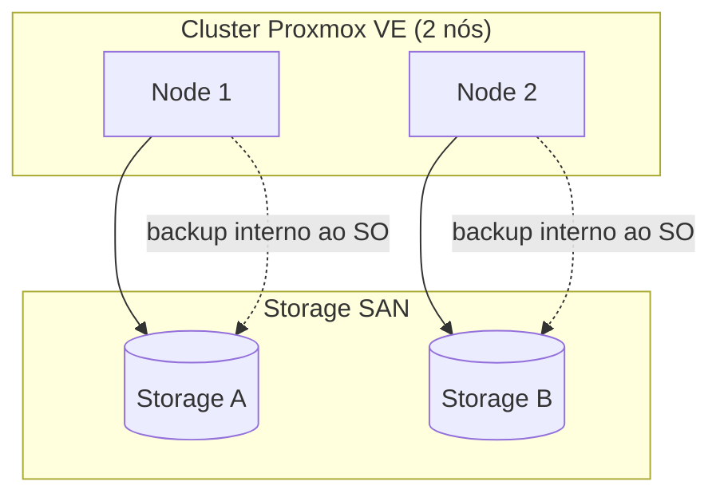
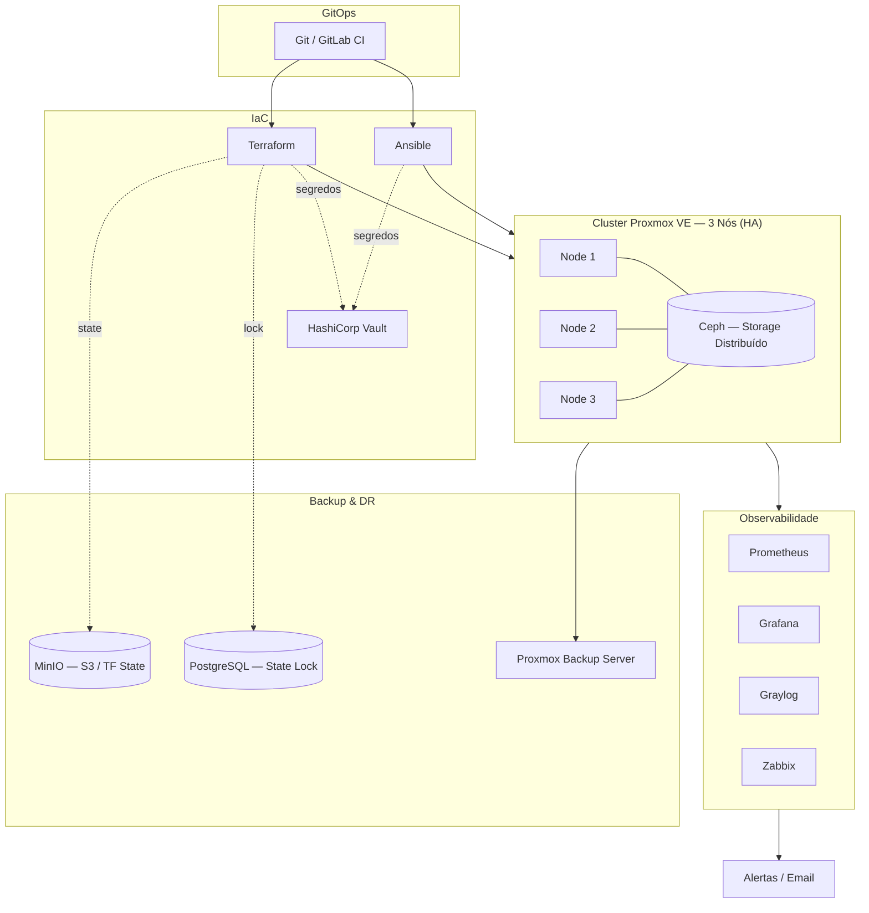

# 02 — Arquitetura

> ⚠️ Todos os endereços IP, hostnames e identificadores abaixo são **fictícios** (sanitizados). A sub-rede usada nos exemplos é `10.0.10.0/24`.

## Arquitetura Atual (estado inicial)

Antes do projeto, o ambiente consistia em um cluster de virtualização com backups internos ao SO e gestão majoritariamente manual.

**Limitações:**

- Sem HA — falha de um nó exige migração manual.
- Backup apenas de dados; sem reprovisionamento automatizado.
- Sem state versionado, sem gestão central de segredos, sem observabilidade unificada.

## Arquitetura Alvo (estado desejado)

### Componentes-chave

| Componente | Função | Garante |
|---|---|---|
| **Proxmox VE (3 nós)** | Virtualização + cluster | Quórum e HA |
| **Ceph** | Storage distribuído replicado | Disponibilidade do dado entre nós |
| **Proxmox HA** | Failover automático de VMs | MTTR baixo em falha de nó |
| **Proxmox Backup Server** | Backup deduplicado e verificado | Restore garantido |
| **Terraform** | Provisionamento declarativo | Infra reproduzível |
| **Ansible** | Configuração idempotente | Consistência de SO/serviços |
| **Vault** | Segredos centralizados | Redução de risco |
| **MinIO + PostgreSQL** | State remoto + locking | State seguro e travado |
| **Prometheus/Grafana/Graylog/Zabbix** | Observabilidade | Detecção rápida |

## Inventário (exemplo sanitizado)

Tabela ilustrativa de como o inventário é documentado na Fase 0. **Valores fictícios.**

| VMID | Nome | Node | vCPU | RAM | Disco | IP | Função | Criticidade | HA |
|---|---|---|---|---|---|---|---|---|---|
| 101 | svc-monitor-ct | node1 | 2 | 4 GiB | 20 GB | 10.0.10.31 | Monitoramento | Baixa | CT |
| 102 | svc-ipam | node1 | 4 | 4 GiB | 20 GB | 10.0.10.22 | Doc. de Redes | Média | CT |
| 110 | svc-fileserver | node1 | 8 | 8 GiB | 100 GB | 10.0.10.5 | File Server | **Alta** | ✔ |
| 112 | svc-dc01 | node1 | 8 | 16 GiB | 64 GB | 10.0.10.1 | AD / DNS / DHCP | **Alta** | ✔ |
| 114 | svc-gitlab | node2 | 8 | 32 GiB | 100 GB | 10.0.10.43 | CI / Registry | **Alta** | ✔ |
| 116 | svc-iac | node2 | 8 | 8 GiB | 100 GB | 10.0.10.41 | Terraform/Ansible | Média | ✔ |
| 117 | svc-itsm | node2 | 8 | 16 GiB | 100 GB | 10.0.10.42 | Inventário/ITSM | **Alta** | ✔ |
| 118 | svc-observ | node3 | 8 | 16 GiB | 100 GB | 10.0.10.40 | Observabilidade | **Alta** | ✔ |
| 122 | svc-ntp | node3 | 2 | 4 GiB | 20 GB | 10.0.10.15 | Servidor de Hora | **Alta** | ✔ |

### Convenção de criticidade

- **Alta** — serviço cuja indisponibilidade impacta toda a operação → HA obrigatório + backup frequente.
- **Média** — impacto parcial → backup diário, HA recomendado.
- **Baixa** — impacto local → backup periódico.

Ver também [`07-naming-conventions.md`](07-naming-conventions.md).
