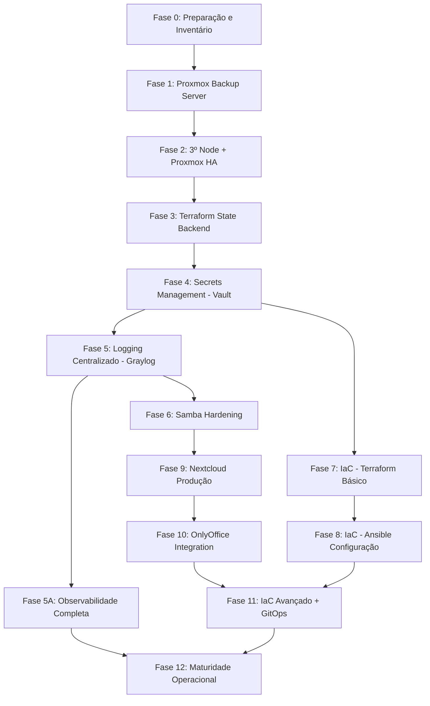

# 03 — Roadmap de Implementação

O projeto é executado em **12 fases** (~42 semanas), de forma incremental e validada. Cada fase crítica possui um *checkpoint* **Go/No-Go**.

> **Regra de ouro:** se um *checkpoint* falhar, **pare e resolva antes de avançar**.

## Sequência Master

## Detalhamento das Fases

### Fase 0 — Preparação e Inventário (Semana 1)
Documentar o estado atual, preparar hardware do 3º nó, planejar rede/storage e definir *naming conventions*.
**Entregas:** inventário completo, 3º nó instalado, planejamento de rede e storage, convenções documentadas, cronograma aprovado.
**Go/No-Go:** tudo documentado e aprovado pela equipe.

### Fase 1 — Proxmox Backup Server (Semanas 2–4)
Instalar e configurar o PBS, datastore, usuários/permissões, jobs de backup, retenção, prune/GC e **teste de restore**.
**Go/No-Go:** ✅ **Restore test PASSOU.** Sem isso, não avance.

### Fase 2 — Terceiro Node + Proxmox HA (Semanas 5–7)
Adicionar o 3º nó ao cluster, configurar Ceph (`HEALTH_OK`), criar pool, configurar *fencing*, habilitar HA e migrar VMs críticas.
**Go/No-Go:** ✅ **Failover test PASSOU** — VMs migraram e voltaram online.

### Fase 3 — Terraform State Backend (Semanas 8–10)
MinIO em HA no Ceph com bucket `terraform-state` versionado, usuário Terraform, PostgreSQL com database de *locks*. Inclui treinamento da equipe (Fundamentos de SRE, Git & Gitflow, Containers).
**Go/No-Go:** state persistente e travado.

### Fase 4 — Secrets Management / Vault (Semanas 11–12)
Vault instalado e inicializado, *unseal keys* protegidas (cópias físicas), policies, migração de segredos críticos, integração com GitLab CI.
**Go/No-Go:** unseal keys seguras e segredos migrados.

### Fase 5 — Logging Centralizado / Graylog (Semanas 13–15)
Stack Graylog + Elasticsearch + MongoDB, inputs (Syslog, GELF, Beats), streams por fonte, retenção, dashboards e integração com Zabbix.
**Go/No-Go:** 100% dos sistemas enviando logs.

### Fase 5A — Observabilidade Completa (Semanas 16–20)
Integrar **logs (Graylog) + métricas (Zabbix/Prometheus) + visualização (Grafana)**. Templates Proxmox/PBS, triggers, baseline, exporters (node, cAdvisor, pve), correlação no Grafana.
**Validação:** ver métricas em tempo real, alerta de nó offline em < 2 min, correlacionar alerta Zabbix com logs Graylog, troubleshooting de incidente simulado só com Grafana.

### Fase 6 — Samba Hardening (Semanas 21–22)
Desabilitar SMB1, encryption obrigatória, integração com AD validada, logging para Graylog, backup integrado ao PBS.

### Fase 7 — IaC / Terraform Básico (Semanas 23–25)
Repositório estruturado, backend S3 (MinIO), módulo `vm-linux`, import de VMs não-críticas, pipeline CI básico (validate + plan).
**Go/No-Go:** 2+ VMs importadas sem *drift*.

### Fase 8 — IaC / Ansible Configuração (Semanas 26–29)
Repositório `ansible-config`, inventário dinâmico do Proxmox, roles (`common-linux`, `common-windows`, `docker`, `monitoring-agent`), playbooks e integração Terraform → Ansible (provision → configure).

### Fase 9 — Nextcloud Produção (Semanas 30–32)
Nextcloud em Docker, integração com AD, storage backend, hardening, backup automático e teste de restore, piloto com 1 departamento.
**Go/No-Go:** restore OK + integração AD OK.

### Fase 10 — OnlyOffice Integration (Semana 33)
OnlyOffice integrado ao Nextcloud com edição colaborativa funcional e backup.

### Fase 11 — IaC Avançado + GitOps (Semanas 34–37)
80%+ das VMs gerenciadas por Terraform, Ansible para toda configuração, GitOps light (merge = apply em staging), segredos 100% no Vault, rotação automática de tokens, DR testado (state + Vault).

### Fase 12 — Maturidade Operacional (Semanas 38–42)
Runbooks completos, monitoramento completo, **DR testado end-to-end**, postmortems de incidentes da implementação, plano de melhoria contínua, treinamentos (CI/CD, fluxo de trabalho).

## Checkpoints Críticos (Go/No-Go)

| Fase | Checkpoint | Critério Mínimo |
|---|---|---|
| Fase 1 | PBS funcional | Restore test PASSOU |
| Fase 2 | HA operacional | Failover test PASSOU |
| Fase 3 | State backend | State persistente e travado |
| Fase 4 | Vault seguro | Unseal keys seguras, secrets migrados |
| Fase 5 | Logs centralizados | 100% sistemas enviando logs |
| Fase 7 | Terraform básico | 2+ VMs importadas sem drift |
| Fase 9 | Nextcloud produção | Restore OK, AD integration OK |
