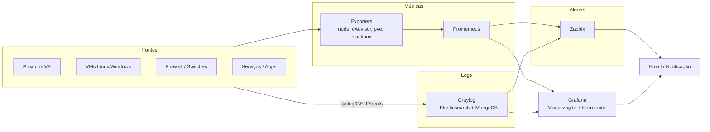

# 05 — Observabilidade

Estratégia de observabilidade unificada combinando os **três pilares**: logs, métricas e visualização/alertas. O objetivo é detectar, diagnosticar e correlacionar incidentes rapidamente — reduzindo o MTTR.

## Stack

## Pilares

### 1. Métricas — Prometheus
Coleta por *pull* via exporters:

- **node_exporter** — CPU, RAM, disco, rede de cada host.
- **cAdvisor** — métricas de containers Docker.
- **pve_exporter** — métricas do cluster Proxmox.
- **blackbox_exporter** — disponibilidade e latência (probing HTTP/ICMP).
- exporters específicos: `gitlab-exporter`, `postgres_exporter`, `nextcloud-exporter`.

Exemplo de configuração: [`../observability/prometheus/prometheus.yml`](../observability/prometheus/prometheus.yml).
Regras de alerta: [`../observability/prometheus/alerts/proxmox-alerts.yml`](../observability/prometheus/alerts/proxmox-alerts.yml).

### 2. Logs — Graylog
Stack Graylog + Elasticsearch + MongoDB:

- **Inputs:** Syslog (rede/SO), GELF (apps), Beats.
- **Streams** por fonte: Proxmox, Linux, Windows, firewall, switches.
- **Retenção** definida por criticidade da fonte.
- Integração com Zabbix para gerar alertas a partir de padrões de log.

### 3. Visualização & Alertas — Grafana + Zabbix
- **Grafana** consolida métricas (Prometheus) e logs (Graylog) em dashboards, permitindo **correlação** num único painel.
- **Zabbix** atua na camada de triggers/notificações, com templates para Proxmox VE e PBS.

## Estratégia de Alertas

Princípios para evitar fadiga de alerta:

- Alertar somente sobre **sintomas que afetam o usuário** ou que indicam risco iminente (ex.: nó offline, Ceph degradado, backup falhando).
- Dois níveis: **Warning** (investigar) e **Critical** (ação imediata).
- Todo alerta crítico aponta para um **runbook** correspondente (ver [`runbooks/`](runbooks/)).

Os thresholds estão definidos em [`04-slo-sli.md`](04-slo-sli.md).

## Critério de Maturidade

A observabilidade é considerada madura quando é possível fazer *troubleshooting* de um incidente simulado **usando apenas o Grafana**, com alerta de nó offline em **menos de 2 minutos**.
