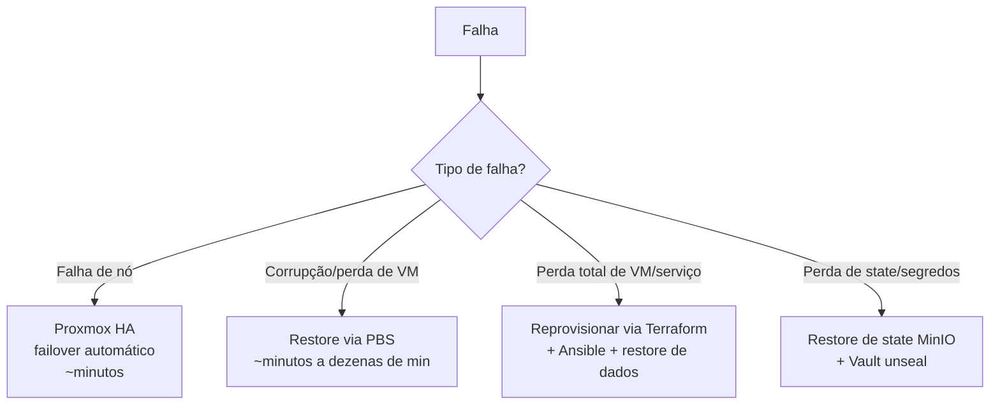

# 06 — Disaster Recovery (DR)

DR é um requisito de design desde o início (princípio **Recuperável**). Este documento descreve a estratégia que sustenta a meta de **MTTR ≤ 5 minutos**.

## Objetivos

| Métrica | Definição | Meta |
|---|---|---|
| **RTO** (Recovery Time Objective) | Tempo máximo aceitável para restaurar o serviço | ≤ 5 min (HA) / ≤ 30 min (restore completo) |
| **RPO** (Recovery Point Objective) | Perda máxima aceitável de dados | ≤ 24 h (crítico: ≤ 1 h) |
| **MTTR** | Tempo médio real de recuperação | ≤ 5 min |

## Camadas de Recuperação

A estratégia é defesa em profundidade — cada camada cobre um tipo diferente de falha:

### 1. Alta Disponibilidade (Proxmox HA + Ceph)
Falha de um nó → VMs marcadas como HA migram automaticamente para um nó saudável. O Ceph mantém os dados replicados, então não há perda. **Cobre a maioria das falhas de hardware com MTTR de minutos.**

### 2. Backup (Proxmox Backup Server)
Backups deduplicados, verificados periodicamente e com **restore testado** (checkpoint da Fase 1). Cobre corrupção lógica, exclusão acidental e falhas que o HA não resolve.

### 3. Reprovisionamento via IaC
Para perda total de uma VM/serviço, a infraestrutura é **reconstruída a partir do código** (Terraform provisiona, Ansible configura) e os dados são restaurados do PBS. Elimina a reconstrução manual que causava o MTTR de 24h.

### 4. State e Segredos
- **Terraform state** versionado no MinIO (bucket com versionamento) + lock no PostgreSQL.
- **Vault** com *unseal keys* protegidas (cópias físicas em locais seguros). Procedimento de unseal documentado em runbook.

## Testes de DR

DR não testado é DR inexistente. O projeto exige:

- **Restore test** do PBS antes de avançar da Fase 1.
- **Failover test** antes de avançar da Fase 2.
- **DR end-to-end** na Fase 12 (state + Vault + reprovisionamento completo).

## Runbooks relacionados

- [`runbooks/runbook-failover-ha.md`](runbooks/runbook-failover-ha.md)
- [`runbooks/runbook-restore-backup.md`](runbooks/runbook-restore-backup.md)
- [`runbooks/runbook-node-offline.md`](runbooks/runbook-node-offline.md)
